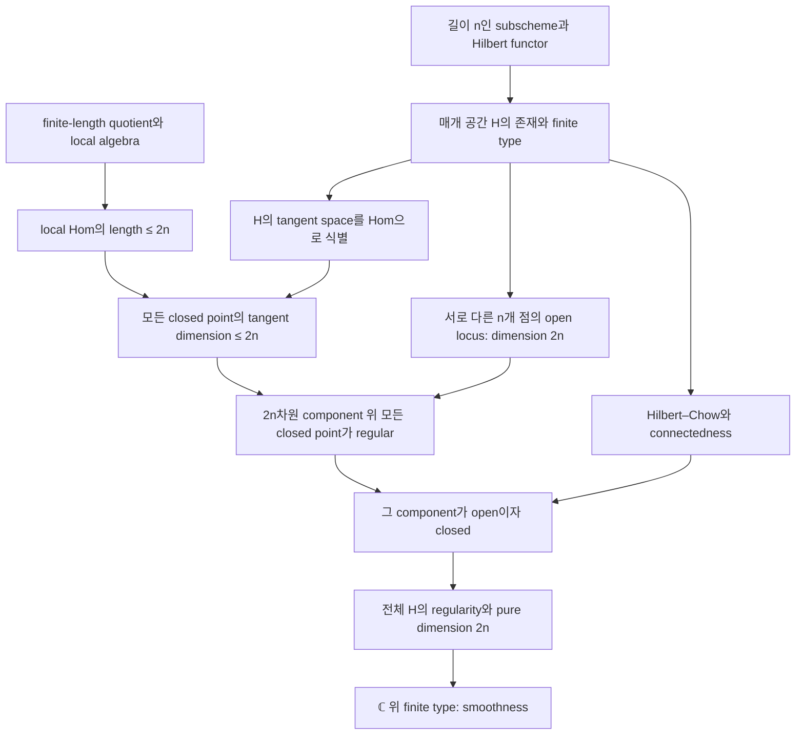

# Hilbert scheme of points: 증명과 formalization 로드맵

## 학습 방식

이 프로젝트에서는 에이전트가 자연어 증명을 작성하고 Lean으로 형식화한다. 사용자는 수학적 의미, 코드와 증명의 대응, 검증 방법을 읽고 이해한다. 직접 tactic 문제를 풀 필요는 없다.

## 목표와 최초 범위

최종 관심사는 smooth surface의 Hilbert scheme of points의 smoothness이다. 첫 완성 목표는 범위를 명확히 좁힌 다음 명제다.

> S가 ℂ 위의 smooth connected projective surface이면, 길이 n인 closed subscheme을 매개하는 H = Hilbⁿ(S)는 ℂ 위에서 smooth이고 pure dimension은 2n이다.

n = 0이면 빈 subscheme을 매개하는 Spec ℂ가 되는 경우를 별도로 다룬다. n ≥ 1에서 아래 흐름을 사용한다. 이 문장은 **수학적 목표**이며, 아직 구현되거나 Lean에서 검증된 theorem statement가 아니다. 이후 smooth quasi-projective surface로 확장하려면 별도의 locality/covering 논증이 필요하다.

참고: [Fogarty, Algebraic Families on an Algebraic Surface (1968)](https://pi.math.cornell.edu/~mike/7670-fa20/references/fogarty-1968.pdf), Proposition 2.3, Theorem 2.4, Lemma 2.5. 아래는 그 증명 구조를 학습과 구현에 맞게 나눈 계획이다.

**아래 연결도와 M0–M7은 Fogarty 경로의 참고 baseline이다.** 현재 우선 구현 경로는 소스 audit에 근거한 **commuting operators → explicit basis charts → smoothness → 일반 surface의 locality**다. [실제 API·prototype 비교](library-route-audit.md)와 [후보 경로 비교](proof-routes.md)를 참고한다. 최초 projective 범위는 시작 범위이지 smoothness 정리 자체에 projectivity가 필수라는 뜻은 아니다.

## 전체 연결도

**작은 tangent space만으로 smoothness가 따라오지는 않는다.** local dimension과 tangent dimension을 비교할 근거, 그리고 다른 component가 남지 않는다는 논증이 함께 필요하다.

## 단계별로 무엇을 이해하고 증명할까?

### M0 — statement와 dependency audit

S, H, length, tangent space, smoothness의 정확한 정의를 고른다. 기존 Mathlib 결과와 새로 만들어야 할 내용을 구분한다. Hilbert scheme의 이름만 선언하거나 결론을 가정해서 전체 정리를 증명한 것처럼 만들지 않는다.

### M1 — 점 하나의 구체적 계산: 첫 번째 학습 자료

R = k[x,y], m = (x,y), R/m ≃ k에서 출발한다. 원점에 놓인 길이 1의 subscheme을 ideal과 quotient로 읽는다.

R-linear map m → k는 m²를 죽이므로 m/m²를 통해 내려간다. 역으로 k-linear map m/m² → k는 R-linear map을 만든다. 따라서

Hom_R(m,k) ≃ Hom_k(m/m²,k).

m/m²에서 x와 y의 class가 basis를 이루므로 양쪽 vector space의 dimension은 2다. 이는 **local algebra 예제**다. 이것을 Hilbert scheme의 tangent space라고 부르려면 M5의 식별이 추가로 필요하다.

산출물: 자연어 증명 → 컴파일된 Lean 정의와 theorem → 줄별 해설 → 재검증 명령. general k로 구현 가능하면 그렇게 하되, 전체 정리의 기본 범위는 ℂ로 유지한다.

### M2 — finite-length local algebra

Q = A/I의 length가 n이라는 의미를 정의하고, exact sequence에서 length가 더해지는 계산을 준비한다. 여러 support point로 분해될 때 전체 length가 local length의 합이라는 결과도 필요하다.

대수적으로 닫힌 base field 위 closed point의 residue field가 base field와 같다는 조건 아래, 해당 finite-length module의 length와 base-field dimension을 연결한다. 이 조건 없이 둘을 동일시하지 않는다.

### M3 — 핵심 local bound

A가 dimension 2인 regular local ring이고 I가 maximal-ideal-primary인 proper ideal일 때 다음 bound를 목표로 한다.

length_A Hom_A(I,A/I) ≤ 2 · length_A(A/I).

구현 경로 후보는 finite free resolution, Hom/Ext exact sequence, 그리고 local duality를 이용한 length 계산이다. resolution과 duality의 필요한 특수형이 이미 제공되는지 먼저 확인한다. 없다면 그 기반을 구현하거나 다른 증명 경로를 검토한다. 단순히 Ext가 존재한다는 사실만으로 duality가 구현되어 있다고 판단하지 않는다.

### M4 — Hilbert functor와 scheme

각 test scheme T에 대해 S × T 안의 closed family 중 T 위 finite flat, rank n인 family를 매개하는 functor를 정의한다. base change 및 functoriality를 확인하고, 그것을 대표하는 scheme H와 universal family를 확보한다.

이 단계가 큰 dependency가 될 수 있다. ℂ-valued point의 ideal 목록만 만든 것으로 representability를 대신할 수 없다. affine-plane 버전의 explicit charts는 구현 경로 후보지만, chart의 gluing과 moduli 해석을 증명해야 한다.

### M5 — first-order deformation과 tangent space

dual numbers k[ε]/(ε²) 위 family로 tangent vector를 해석한다. Z의 ideal sheaf I_Z에 대해

T_[Z]H ≃ Hom_{O_S}(I_Z,O_Z)

라는 k-linear equivalence를 만든다. 유한 support로 분해해서 M3를 적용하면 전체 tangent dimension이 2n 이하라는 bound를 얻는다.

### M6 — global dimension과 connectedness

서로 다른 n개 점을 나타내는 reduced locus가 open이고 dimension 2n임을 보인다. 따라서 H에는 dimension 2n인 irreducible component C가 있다.

또한 connected S에 대해 H의 connectedness가 필요하다. 참고 증명은 Hilbert–Chow map, 그 fibres의 local factor 분해, punctual Hilbert schemes의 connectedness를 이용한다. 이들은 각각 증명이 필요한 별도의 dependency이며, smoothness나 irreducibility를 미리 가정하지 않는다.

### M7 — local 계산에서 global smoothness로

C 위 closed point z에서는 local dimension이 2n 이상이고, tangent dimension은 2n 이하이므로 둘이 같아진다. 여기에는 finite-type scheme의 dimension 이론이 필요하다. local ring이 regular가 되므로 그 점에서는 다른 irreducible component와 만나지 않는다.

finite type/Jacobson 성질을 통해 closed point에서의 결론을 필요한 전체 locus로 확장한다. C가 다른 component들과 분리되어 open이자 closed임을 보이고, H의 connectedness를 사용해 C = H를 얻는다. 마지막으로 perfect field ℂ 위 finite-type scheme의 regularity를 smoothness로 연결한다.

## Lean 구현 순서와 현황

수학적 의존성과 구현 순서는 다르다. M4의 전체 representability를 완성하기 전에 M1–M3의 독립적인 algebra부터 진행할 수 있다.

| 단계 | 현재 상태 | 완료 판단 기준 |
|---|---|---|
| M0 | preliminary audit | 정확한 statement와 각 dependency의 실제 API/누락 목록 |
| M1 | planned, 참고 예제 | quotient·cotangent·Hom equivalence와 dimension 2의 컴파일 및 axiom audit |
| M2 | planned | 필요한 finite-length 결과의 proof와 import graph |
| M3 | planned | local bound의 unconditional proof |
| M4 | planned, major dependency | Hilbert functor representability와 필요한 scheme 성질 |
| M5 | planned | tangent-space bridge 및 global bound |
| M6 | planned | reduced locus dimension과 connectedness |
| M7 | planned | 모든 dependency를 discharge한 smoothness theorem |

2026-10-07 현재 고정 환경: Lean `v4.35.0-rc4`, Mathlib `e6bbacd0e1b7307ff6e17da09cd2455f60804fa6`.

해당 checkout에서 아래 **파일의 존재**를 확인했다. declaration 타입과 우리에게 필요한 theorem까지 검증한 것은 아니다.

- `Mathlib/RingTheory/MvPolynomial/Ideal.lean`
- `Mathlib/RingTheory/Ideal/Cotangent.lean`
- `Mathlib/RingTheory/Length.lean`, `FiniteLength.lean`
- `Mathlib/RingTheory/RegularLocalRing/Defs.lean`
- `Mathlib/CategoryTheory/Abelian/Ext.lean`
- `Mathlib/AlgebraicGeometry/Morphisms/Smooth.lean`

`HilbertScheme`, `Hilbert scheme`, `Fogarty` 문자열 검색은 결과가 없었다. 이 사실은 다른 이름의 구현도 없다는 완전한 증명은 아니다. representability, deformation theory, local duality, connectedness의 지원 범위는 추가 audit이 필요하다.

## 작업 기록 원칙

완료된 각 단계에는 (1) 자연어 증명, (2) 실제 Lean 파일과 theorem 이름, (3) 실행 명령과 결과, (4) 남은 가정을 기록한다. conditional theorem도 유용한 산출물이지만 전체 정리 완료와 구분한다.

검증 절차는 [verification.md](verification.md), 에이전트의 지속적인 작업 지침은 [AGENTS.md](../../AGENTS.md)에 기록한다.
